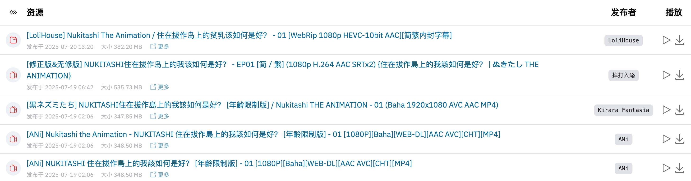

# 🌸 AnimeGarden

[](https://t.me/+QLdRRqoDt1gxMWZl)
[](https://deepwiki.com/yjl9903/AnimeGarden)
[](https://www.npmjs.com/package/animegarden)
[](https://github.com/yjl9903/AnimeGarden/actions/workflows/ci.yml)

[English](/README.en.md) | [简体中文](/README.md)

[動漫花園](https://share.dmhy.org/) 3-rd party [mirror site](https://animes.garden) and [Anime Torrent aggregation site](https://animes.garden).

+ ☁️ Provide [API endpoint](https://animes.garden/docs/api) for developers
+ 📺 View [bangumi onair calendar](https://animes.garden/anime) to find your favourite anime easily
+ 🔖 Support Advanced search, i.e. `葬送的芙莉莲 +简体内嵌 fansub:桜都字幕组 type:动画`
+ 📙 Generate RSS feed, i.e. [葬送的芙莉莲](https://animes.garden/feed.xml?filter=%5B%7B%22fansubId%22:%5B%22619%22%5D,%22type%22:%22%E5%8B%95%E7%95%AB%22,%22include%22:%5B%22%E8%91%AC%E9%80%81%E7%9A%84%E8%8A%99%E8%8E%89%E8%8E%B2%22%5D,%22keywords%22:%5B%22%E7%AE%80%E4%BD%93%E5%86%85%E5%B5%8C%22%5D%7D%5D)
+ ⭐ Bookmark management and generate aggregated RSS feed
+ 👷‍♂️ Support [AutoBangumi](https://www.autobangumi.org/) and [AnimeSpace](https://github.com/yjl9903/AnimeSpace)

> Document: [Generated by DeepWiki](https://deepwiki.com/yjl9903/AnimeGarden)
>
> Discussion: [Telegram](https://t.me/+QLdRRqoDt1gxMWZl)

[](https://animes.garden/resources/1?subject=477825)

## Open API Usage

```bash
curl "https://api.animes.garden/resources?page=1&pageSize=10"
```

You can find the [interactive Open API document](https://animes.garden/docs/api) and more API usage example in [examples/api.http](./examples/api.http).

If you are using JavaScript / TypeScript, you can just use the API wrapper `fetchResources` and `fetchResourceDetail` in package [animegarden](https://www.npmjs.com/package/animegarden).

## MCP Configuration

Anime Garden MCP API endpoint: `https://api.animes.garden/mcp`.

Add following snippets to your MCP client config file.

```json
{
  "mcpServers": {
    "animegarden": {
      "url": "https://api.animes.garden/mcp"
    }
  }
}
```

## NPM Package Usage

[AnimeGarden](https://animes.garden) API client and utils for JavaScript / TypeScript.

```bash
npm i @animegarden/client
```

```ts
import { fetchResources } from '@animegarden/client'

// Fetch the first page of Anime Garden mirror site
const resources = await fetchResources()

// Fetch all the resources which match some filter conditions
const sakurato = await fetchResources({ count: -1, fansub: 'ANi' })
```

Assume your environment has built-in [Fetch](https://developer.mozilla.org/en-US/docs/Web/API/Fetch_API/Using_Fetch). If not you can use [undici](https://github.com/nodejs/undici) or [ofetch](https://github.com/unjs/ofetch) to polyfill.

You can check more filter conditions [FilterOptions](https://github.com/yjl9903/AnimeGarden/blob/32bc3843084367338f41be7d4af47c80b639f828/packages/client/src/types.ts#L220) and usage examples in [./examples/](https://github.com/yjl9903/AnimeGarden/blob/main/examples/) directory.

## Iframe Usage

You can easily copy the iframe HTML code from the resources page and embed the resource list into your blog or any other website.

```html
<iframe src="//animes.garden/iframe?subject=477825" width="100%" height="600" frameborder="0"></iframe>
```

## Local Development

Follow [CONTRIBUTING.md](./CONTRIBUTING.md) to setup the environment and start developing.

## Related Projects

+ [AnimeSpace](https://github.com/yjl9903/AnimeSpace): Keep following your favourite anime
+ [Anitomy](https://github.com/yjl9903/anitomy): A TypeScript port of Anitomy inspired by AnitomySharp.
+ [bgmc](https://github.com/yjl9903/bgmc): Bangumi Data / API Clients

## Credits

+ [動漫花園](https://share.dmhy.org/)
+ [萌番组](https://bangumi.moe/)
+ [Bangumi 番组计划](https://bgm.tv/)
+ [bangumi-data](https://github.com/bangumi-data/bangumi-data)
+ [erengy/anitomy](https://github.com/erengy/anitomy)
+ [tabratton/AnitomySharp](https://github.com/tabratton/AnitomySharp)

## License

AGPL-3.0 License © 2023 [XLor](https://github.com/yjl9903)
