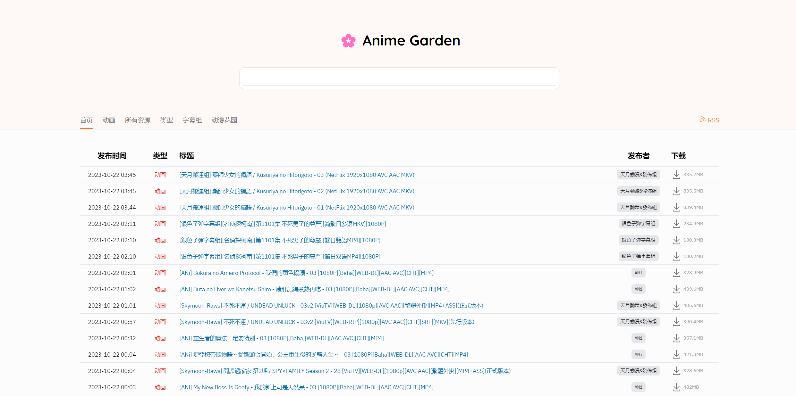

# 🌸 AnimeGarden

[](https://www.npmjs.com/package/animegarden)
[](https://garden.onekuma.cn)
[](https://github.com/yjl9903/AnimeGarden/actions/workflows/deploy.yml)
[](https://github.com/yjl9903/AnimeGarden/actions/workflows/ci.yml)

[English](/README.en.md) | [简体中文](/README.md)

[動漫花園](https://share.dmhy.org/) 第三方 [镜像站](https://garden.onekuma.cn) 以及 [动画 BT 资源聚合站](https://garden.onekuma.cn).

+ ☁️ 为开发者准备的开放 [API 接口](https://garden.onekuma.cn/docs/api)
+ 📺 查看 [动画放送时间表](https://garden.onekuma.cn/anime) 来找到你喜欢的动画
+ 🔖 支持丰富的高级搜索, 例如: `葬送的芙莉莲 +简体内嵌 字幕组:桜都字幕组 类型:动画`
+ 📙 自定义 RSS 订阅链接, 例如: [葬送的芙莉莲](https://garden.onekuma.cn/feed.xml?filter=%5B%7B%22fansubId%22:%5B%22619%22%5D,%22type%22:%22%E5%8B%95%E7%95%AB%22,%22include%22:%5B%22%E8%91%AC%E9%80%81%E7%9A%84%E8%8A%99%E8%8E%89%E8%8E%B2%22%5D,%22keywords%22:%5B%22%E7%AE%80%E4%BD%93%E5%86%85%E5%B5%8C%22%5D%7D%5D)
+ ⭐ 搜索条件收藏夹和生成聚合的 RSS 订阅链接
+ 👷‍♂️ 支持与 [AutoBangumi](https://www.autobangumi.org/) 和 [AnimeSpace](https://github.com/yjl9903/AnimeSpace) 集成



## API 的使用

```bash
curl "https://garden.onekuma.cn/api/resources?page=1&pageSize=10"
```

你可以在[这里](https://garden.onekuma.cn/docs/api)找到交互式的 Open API 文档, 以及在本仓库的 [scripts/api.http](./scripts/api.http) 文件内查看到更多 API 用例.

如果你正在使用 JavaScript 和 TypeScript 进行开发, 那么你可以直接使用 npm 包 [animegarden](https://www.npmjs.com/package/animegarden), 它是对这些 API 请求的上层封装.

## npm 包的使用

它是 [AnimeGarden](https://garden.onekuma.cn) 的 JavaScript / TypeScript 的 API 客户端封装.

```bash
npm i animegarden
```

```ts
import { fetchResources } from 'animegarden'

// Fetch the first page of Anime Garden mirror site
const resources = await fetchResources(fetch)

// Fetch all the resources which match some filter conditions
const sakurato = await fetchResources(fetch, { count: -1, fansub: 619 })
```

使用时, 你需要保证你的程序环境中有内置的 [Fetch](https://developer.mozilla.org/en-US/docs/Web/API/Fetch_API/Using_Fetch) 函数. 如果没有, 你可以安装使用 [undici](https://github.com/nodejs/undici) 或者 [ofetch](https://github.com/unjs/ofetch).

你可以在[这里](https://github.com/yjl9903/AnimeGarden/blob/main/packages/animegarden/src/garden/types.ts)查看更多过滤条件 `FilterOptions`, 也可以在 [./scripts/](https://github.com/yjl9903/AnimeGarden/blob/main/scripts/) 目录下找到更多程序示例.

## 本地开发

参考 [CONTRIBUTING.md](./CONTRIBUTING.md) 中的描述配置环境和开始开发.

## 相关项目

+ [AnimeSpace](https://github.com/yjl9903/AnimeSpace): Keep following your favourite anime
+ [Anitomy](https://github.com/yjl9903/anitomy): A TypeScript port of Anitomy inspired by AnitomySharp.
+ [bgmc](https://github.com/yjl9903/bgmc): Bangumi Data / API Clients

## 鸣谢

+ [動漫花園](https://share.dmhy.org/)
+ [Bangumi 番组计划](https://bgm.tv/)
+ [bangumi-data](https://github.com/bangumi-data/bangumi-data)
+ [erengy/anitomy](https://github.com/erengy/anitomy)
+ [tabratton/AnitomySharp](https://github.com/tabratton/AnitomySharp)

## 开源协议

MIT License © 2023 [XLor](https://github.com/yjl9903)
