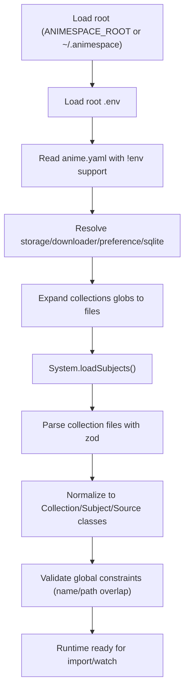

# AnimeSpace v3 设计与实现计划

## 1. 背景与目标

本文件用于沉淀当前 AnimeSpace v3 重构阶段已经确认的设计，作为后续实现 `apps/animespace` 的单一参考。

当前目标：

1. 先冻结配置与归一化模型（`anime.yaml`、`collections/*.yaml`、`source`、`naming`）。
2. 以可实现、可测试为导向，明确规则、流程和验收标准。
3. 为后续 `import` 与 `watch` 实现提供稳定输入契约。

## 2. 当前范围与非范围

### 2.1 In Scope

1. `Space`（`anime.yaml`）结构与加载规则。
2. `Collection` / `Subject` 结构与继承、校验规则。
3. `source`（当前仅 AnimeGarden）结构、归一化、筛选与排序语义。
4. `naming` 的最小结构定义。
5. 最小 `sqlite` 配置入口（仅路径）。

### 2.2 Out of Scope（后续讨论）

1. `source.feed` / `source.magnet` / `source.torrent` 的完整执行实现。
2. SQLite 表结构与同步策略细节。
3. `naming` 的最终命名算法细节（例如季号覆盖策略、合集命名策略）。
4. `RuntimeState` / `SyncScope` 等运行态公共接口。

## 3. 整体架构（当前阶段）



## 4. Space（anime.yaml）设计

基线文件：`apps/animespace/src/system/space.ts`

### 4.1 Root 规则

1. 优先读取环境变量 `ANIMESPACE_ROOT`。
2. 未设置时默认 `~/.animespace`。

### 4.2 `.env` 与 `!env` 支持（新增）

1. 在读取 `anime.yaml` 之前，先从 `<root>/.env` 加载环境变量。
2. YAML 解析器支持 `!env` 指令，用于从环境变量注入敏感配置（如 token、密码）。
3. `!env` 行为迁移自旧版 AnimeSpace 逻辑，保证向后可理解的一致语义。
4. 典型示例：

```yaml
storage:
  default:
    driver: webdav
    url: !env WEBDAV_URL
    username: !env WEBDAV_USERNAME
    password: !env [WEBDAV_PASSWORD, ""]
```

说明：

1. `!env VAR`：读取单个环境变量，未命中时返回 `null`。
2. `!env [VAR1, VAR2, fallback]`：按顺序查找，均未命中时使用 fallback。

### 4.3 字段定义

`anime.yaml` 当前包含：

1. `storage`
2. `downloader`
3. `preference`
4. `collections`
5. `sqlite`

### 4.4 字段语义

1. `storage`
    - key-value 的存储配置。
    - 必须有一个默认存储目标 `default`。
    - 单值输入会被自动归一化为 `default`。
    - 默认值为本地路径的 `<root>/anime`。
    - 加载后会解析为 breadfs 的 Path 实例。

2. `downloader`
    - 当前仅支持 `qbittorrent`。
    - 因一阶段不实现具体下载器调用，配置暂为 placeholder。
    - 加载后保持原配置对象（最小必要校验）。

3. `preference`
    - 当前为 placeholder。
    - 加载后保持原配置对象。

4. `collections`
    - 输入为一个 glob 字符串列表 `string[]`。
    - 加载后, 运行 glob 解析为真实本地文件路径列表。
    - 默认配置: `['collections/*.yml', 'collections/*.yaml']`

5. `sqlite`
    - 仅最小配置：`path?: string`。
    - 默认路径：`<root>/animespace.db`。

## 5. Collection / Subject 设计

### 5.1 输入层与运行层

1. 输入配置层：使用 Zod schema。
2. 归一化运行层：使用 class（非 interface），后续可追加实例方法。

### 5.2 Collection 配置结构（输入）

1. `name?: string`: 仅供识别管理，无运行语义。

2. `enable?: boolean`

3. `subjects: Subject[]`

说明：

1. `defaults.storage` / `defaults.naming` / `defaults.source` 不支持。
2. 继承字段当前只有 `enable`。

### 5.3 Subject 配置结构（输入）

1. `name: string`（全局唯一）
2. `enable?: boolean`
3. `bgm?: number`（直接写 id）
4. `tmdb?: { type: string; id: number }`
5. `storage?: { driver?: string; path?: string }`
6. `naming`（必填，且非 `null`）
7. `source`（必填，且非 `null`）

### 5.4 Subject 归一化规则

1. `enable` 优先级：`subject.enable > collection.enable > true`
2. `storage.driver` 默认 `default`
3. `storage.path` 默认 `subject.name`

### 5.5 全局校验规则

1. `subject.name` 跨所有 collection 文件全局唯一。
2. `storage.driver` 必须存在于 `anime.yaml.storage`。
3. 同一 `driver` 内目录路径禁止前缀重叠：
    - `a` 与 `a/b` 冲突。
    - `a/b` 与 `a` 冲突。
4. 不同 `driver` 间允许相同路径名。
5. `storage.path` 必须是相对路径，禁止绝对路径与 `..`。

## 6. Source 设计（当前仅 AnimeGarden）

### 6.1 概念

`source` 定义“该 subject 的资源从哪里索引并进入后续下载流程”。

当前阶段只实现 AnimeGarden 数据源配置；RSS、magnet、torrent 的完整实现后续迭代。

### 6.2 结构变更（已确认）

1. `source.animegarden.preference` 已移除。
2. 查询字段从 `source.animegarden.filter` 提升到 `source.animegarden` 顶层。
3. 新增 `source.animegarden.order` 仅用于内存排序，不传接口。

### 6.3 source 快捷写法规则

为减少样板配置，支持 `source` 的快捷写法归一化：

1. 若 `source` 不包含 `magnet` / `torrent` / `feed`，则把 `source` 当成 animegarden 配置，归一化为 `source.animegarden`。
2. 若 `source` 包含任一 `magnet` / `torrent` / `feed`，则不走该快捷归一化。
3. 若同时出现 `source.animegarden` 与外层快捷字段（如 `source.include`），直接报错，禁止混用。

### 6.4 AnimeGarden 查询字段

`source.animegarden` 查询字段对齐 `@animegarden/client` 的 `FilterOptions`（完整范围），包含但不限于：

1. `provider`, `duplicate`, `after`, `before`
2. `search`, `include`, `keywords`, `exclude`
3. `type`, `types`
4. `subject`, `subjects`
5. `fansub`, `fansubs`
6. `publisher`, `publishers`

### 6.5 排序字段

`source.animegarden.order`：

1. `fansubs?: string[]`
2. `keywords?: Record<string, string[]>`

`order.keywords` 组优先级按 YAML 声明顺序解释（按对象插入顺序）。

### 6.6 排序语义

1. 字幕组优先级：
    - 优先使用 `order.fansubs`。
    - 未配置时回退使用 `fansubs` 顺序。

2. 关键词优先级：
    - 使用 `order.keywords` 分组比较。
    - 组间按 YAML 声明顺序，组内按“命中任一关键词”判定。

3. 兜底排序：
    - `createdAt` 降序
    - `provider` 升序
    - `fetchedAt` 降序

### 6.7 其他约束

1. `bgm` 不自动注入 animegarden 查询条件。
2. `order` 字段不会传递到 AnimeGarden API。

## 7. Naming 设计（当前最小结构）

### 7.1 概念

`naming` 作用于下载后写入存储前的命名阶段。命名信息来源于：

1. anipar 解析文件名元信息（如季度、集数）
2. `subject` 与 `subject.naming` 配置

### 7.2 当前结构

`naming` 暂时只包含：

1. `name?: string`
2. `season?: number | null`

### 7.3 默认值

1. `name` 默认 `subject.name`
2. `season` 默认 `null`

### 7.4 输入约束

1. `naming` 必填且非 `null`。
2. `season` 仅允许 `number` 或 `null`（不接受字符串）。

## 8. 关键流程设计

### 8.1 配置加载流程

1. 解析 root（环境变量或默认目录）。
2. 从 `<root>/.env` 加载环境变量。
3. 使用支持 `!env` 的 YAML 解析器读取并校验 `anime.yaml`。
4. 归一化 `storage/downloader/preference/sqlite`。
5. 展开 `collections` glob 到本地文件路径。
6. 在 `System.loadSubjects()` 中逐文件解析 collection + subjects。
7. 归一化为 `Collection` / `Subject` / `Source` / `AnimeGardenSource` class。
8. 执行全局唯一性与路径重叠校验。

### 8.2 资源筛选与排序流程（AnimeGarden）

1. 从 `source.animegarden` 生成接口查询参数（剔除 `order`）。
2. 调用 AnimeGarden 资源查询接口拉取候选资源。
3. 按排序规则做内存排序：
    - fansubs 优先
    - keywords 分组优先
    - 时间与来源兜底排序
4. 输出有序资源进入后续下载流程。

## 9. 测试与验收预期

### 9.1 配置与归一化

1. `ANIMESPACE_ROOT` 与默认 root 行为正确。
2. `storage` 单值输入可正确归一化到 `default`。
3. 默认 `storage.default=<root>/anime` 生效。
4. `sqlite.path` 默认与相对路径解析正确。
5. `collections` glob 能正确展开到文件路径。

### 9.2 Collection / Subject 校验

1. `Collection.name` 可省略且不影响运行。
2. `naming` / `source` 缺失或 `null` 报错。
3. `bgm` 非数字时报错。
4. `enable` 继承优先级正确。
5. `subject.name` 全局唯一性检查生效。
6. 同一 driver 路径前缀冲突检查生效。

### 9.3 Source 行为

1. 快捷写法可归一化为 `source.animegarden`。
2. 混用 `source.animegarden` 与外层快捷字段时报错。
3. `order` 不进入接口查询参数。
4. `order.fansubs` 覆盖 `fansubs` 排序；缺省回退 `fansubs`。
5. `order.keywords` 按 YAML 声明顺序生效。
6. 兜底排序顺序稳定。

## 10. 实现步骤（文件级计划）

### Step 1: 完成 Space 加载主线（含 Storage 协作）

目标文件：

1. `apps/animespace/src/system/space.ts`
2. `apps/animespace/src/system/storage.ts`

1. 实现 root 推断（`ANIMESPACE_ROOT` / `~/.animespace`）。
2. 先加载 `<root>/.env`。
3. 解析 `anime.yaml`，加入 `!env` 自定义 tag 支持（迁移旧版实现）。
4. 接入 `storage` 归一化（含 `default` 注入）与 `sqlite.path` 默认化。
5. 展开 `collections` glob 到真实路径。
6. 输出运行态 `Space`。

### Step 2: 抽取 Collection/Subject 模块

目标文件：

1. `apps/animespace/src/subject/collection.ts`（新增）
2. `apps/animespace/src/subject/subject.ts`（新增）
3. `apps/animespace/src/system/system.ts`（更新）

1. 在 `subject/` 目录定义 raw Zod schema。
2. 定义 `Collection` 与 `Subject` class（运行态对象）。
3. 在 `System` 增加独立加载方法（例如 `loadSubjects()`）与校验调用。
4. 实现继承、全局唯一性、路径冲突校验。

### Step 3: 抽取 Source 模块

目标文件：

1. `apps/animespace/src/subject/source.ts`（新增）
2. `apps/animespace/src/subject/source.animegarden.ts`（新增）

1. 定义 `Source` 基类，固化公共接口（解析、查询参数构建、排序）。
2. 定义 `AnimeGardenSource extends Source`。
3. 实现 source 快捷写法归一化与冲突校验。
4. 实现 AnimeGarden 查询参数映射与内存排序逻辑。

### Step 4: 测试补齐

目标目录：`apps/animespace/test/`

1. space 配置解析测试。
2. collection/subject 归一化与校验测试。
3. source 基类与 animegarden source 行为测试。

## 11. 风险与注意事项

1. `order.keywords` 依赖 YAML 对象声明顺序，需在实现与测试中显式验证顺序稳定。
2. source 快捷写法与显式写法并存，冲突检测必须先于归一化。
3. 由于 `source.feed/magnet/torrent` 尚未实现，schema 需避免提前锁死未来扩展路径。
4. `!env` 指令解析属于配置入口关键路径，需覆盖 fallback 与空值场景测试。

## 12. 后续迭代入口

1. 细化 `naming`（episode/season override、合集模式）。
2. 引入 `source.feed/magnet/torrent` 执行器与统一 Source 抽象。
3. 定义 SQLite 表结构、同步策略与 `import/watch` 运行时写入规则。
